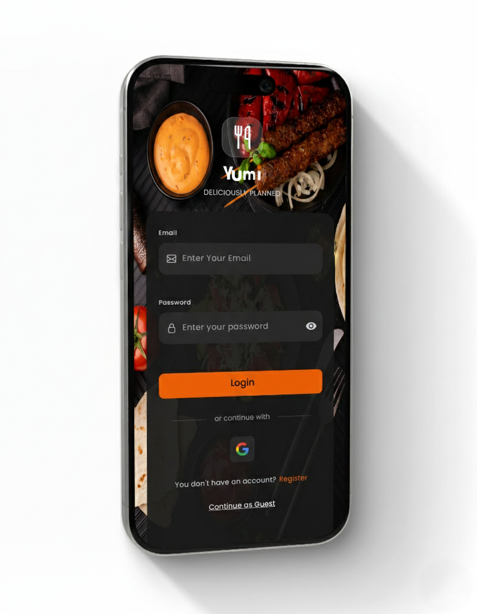
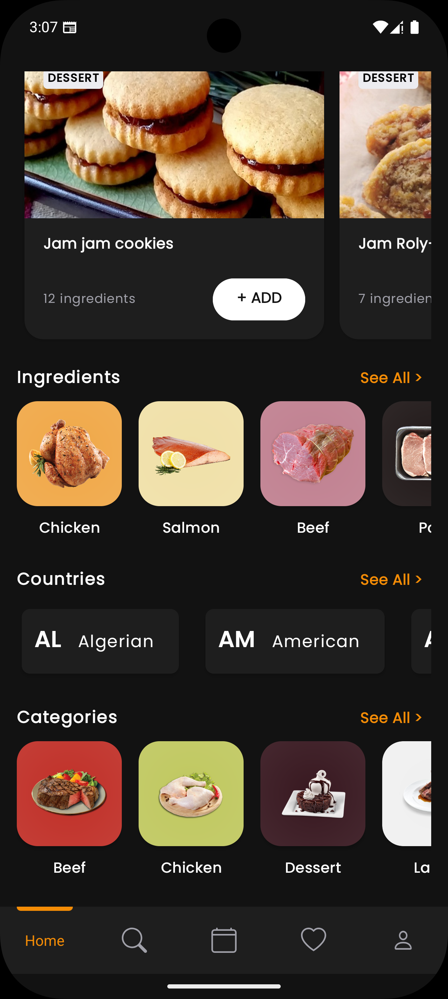
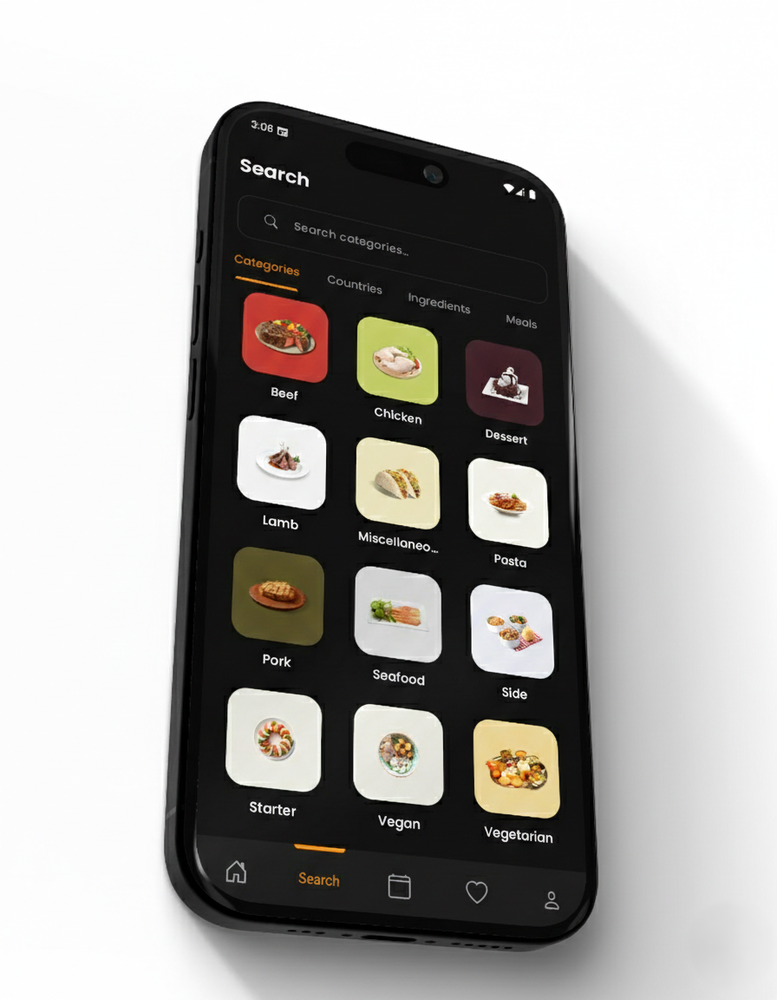
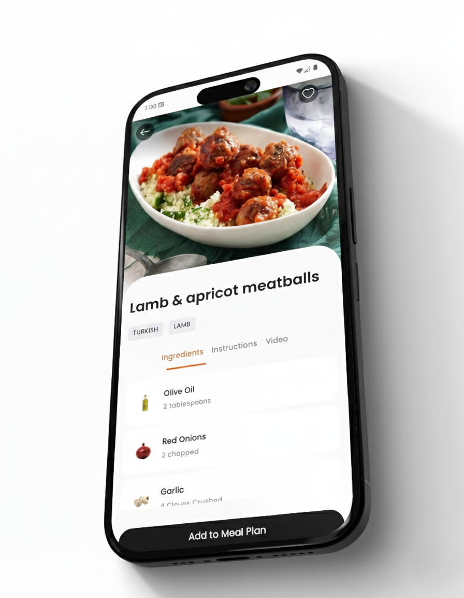
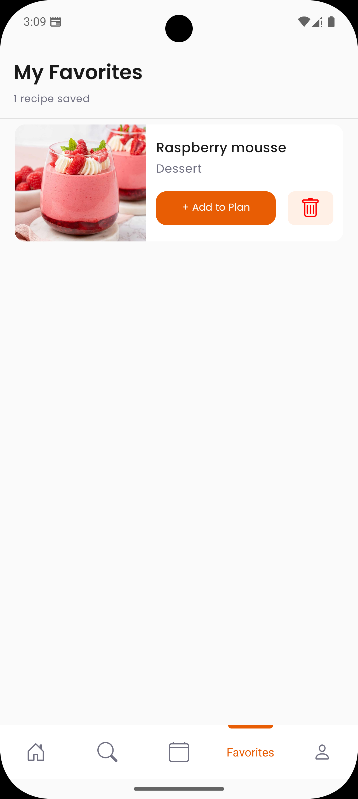
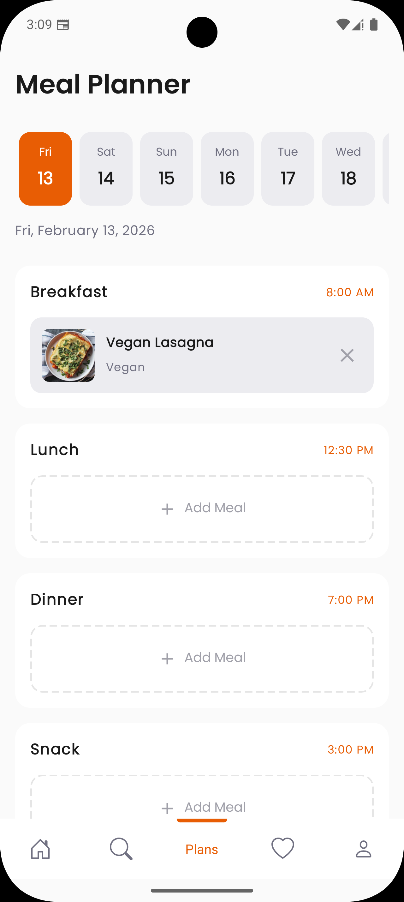
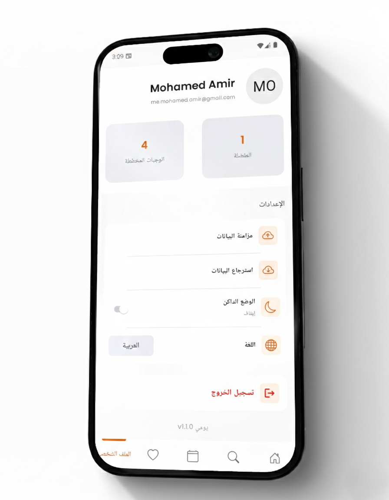

# 🍽️ Yumi - Your Daily Meal Planner


<p align="center">

</p>

<p align="center">
<b>Plan Yummy, Eat Happy!</b>
</p>

<p align="center">
<a href="#features">Features</a> •
<a href="#screenshots">Screenshots</a> •
<a href="#architecture">Architecture</a> •
<a href="#tech-stack">Tech Stack</a> •
<a href="#project-structure">Project Structure</a> •
<a href="#setup">Setup</a> •
<a href="#api">API</a>
</p>
---

## 📖 Description

**Yumi** (يومي) is a modern Android meal planning application that helps users discover, plan, and organize their weekly meals. The app provides meal inspiration, allows searching by categories, countries, and ingredients, and enables users to save their favorite recipes for offline access.

The name "Yumi" means "Daily" in Arabic (يومي) and sounds like "Yummy" in English - perfect for a daily meal planner!

---

## ✨ Features

### 🍳 Meal Discovery

* **Meal of the Day** - Get daily meal inspiration with a random featured meal
* **Random Meals** - Discover new meals with random suggestions
* **Search** - Find meals by name, category, country, or ingredient
* **Categories** - Browse meals organized by food categories (Beef, Chicken, Seafood, etc.)
* **Countries** - Explore cuisines from around the world
* **Ingredients** - Search meals by specific ingredients

### 📅 Meal Planning

* **Weekly Planner** - Plan your meals for the current week
* **Meal Slots** - Organize breakfast, lunch, dinner, and snacks
* **Calendar View** - Easy week navigation with day selection

### ❤️ Favorites & Offline

* **Save Favorites** - Bookmark your favorite meals for quick access
* **Offline Access** - View saved favorites and meal plans without internet
* **Local Storage** - Data persisted using Room database

### 🔐 Authentication

* **Email Login/Signup** - Traditional email authentication
* **Social Login** - Sign in with Google, Facebook, or Twitter
* **Guest Mode** - Browse the app without an account (limited features)
* **Data Sync** - Backup and restore your data across devices using Firebase

### 🎨 User Experience

* **Dark/Light Theme** - Automatic theme switching based on system preference
* **Multi-Language** - Support for English and Arabic (RTL)
* **Modern UI** - Material Design 3 with smooth animations
* **Splash Screen** - Beautiful animated splash with Lottie

---

## 📱 Screenshots

<p align="center">



</p>

<p align="center">




</p>

<p align="center">



</p>

---

## 🏗️ Architecture

This project follows the **MVP (Model-View-Presenter)** architecture pattern with a **Clean Architecture-inspired layered** package structure (`data`, `domain`, `presentation`).

### MVP Pattern

```
┌─────────────────────────────────────────────────────────────┐
│                          VIEW                                │
│            (Activity/Fragment - UI Logic)                    │
│                           │                                  │
│                           ▼                                  │
│  ┌─────────────────────────────────────────────────────┐   │
│  │                    PRESENTER                          │   │
│  │         (Business Logic - Mediator)                   │   │
│  │                        │                              │   │
│  │           ┌────────────┼────────────┐                │   │
│  │           ▼            ▼            ▼                │   │
│  │    ┌──────────┐ ┌──────────┐ ┌──────────┐          │   │
│  │    │  MODEL   │ │  MODEL   │ │  MODEL   │          │   │
│  │    │ (Remote) │ │ (Local)  │ │  (Repo)  │          │   │
│  │    └──────────┘ └──────────┘ └──────────┘          │   │
│  └─────────────────────────────────────────────────────┘   │
└─────────────────────────────────────────────────────────────┘

```

### Layered Architecture

```
┌──────────────────────────────────────────┐
│            PRESENTATION LAYER            │
│   (Activities, Fragments, Presenters,    │
│    Adapters, Custom Views, Callbacks)    │
├──────────────────────────────────────────┤
│              DOMAIN LAYER                │
│   (Repository Interfaces, Models,        │
│    Business Entities)                    │
├──────────────────────────────────────────┤
│               DATA LAYER                 │
│   (API, Room DB, Firebase, SharedPrefs,  │
│    Repository Implementations)           │
└──────────────────────────────────────────┘

```

### Layer Responsibilities

| Layer | Responsibility |
| --- | --- |
| **Presentation** | Display data, handle user interactions, update UI, navigation |
| **Domain** | Repository contracts, business models, use-case definitions |
| **Data** | Data operations (API calls, database, Firebase, config, network) |

### Data Flow

```
User Action → View → Presenter → Domain (Repository Interface)
                                          │
                                          ▼
                                   Data (Repository Impl)
                                          │
                         ┌────────────────┼────────────────┐
                         ▼                ▼                ▼
                   Remote Source     Local Source      Firebase
                   (Retrofit API)   (Room DB)        (Firestore)
                         │                │                │
                         └────────────────┴────────────────┘
                                          │
                                   Presenter (RxJava)
                                          │
                                          ▼
                                   View (Update UI)

```

---

## 🛠️ Tech Stack

| Technology | Purpose |
| --- | --- |
| **Java** | Programming Language |
| **MVP** | Architecture Pattern |
| **RxJava 3** | Reactive Programming & Async Operations |
| **Retrofit 2** | REST API Client |
| **Room** | Local Database (SQLite) |
| **Firebase Auth** | Authentication (Email + Social) |
| **Firebase Firestore** | Cloud Data Sync & Backup |
| **Glide** | Image Loading & Caching |
| **Lottie** | Splash & UI Animations |
| **Material Design 3** | UI Components & Theming |
| **Navigation Component** | Fragment Navigation |
| **SharedPreferences** | User Settings Storage |

---

## 📁 Project Structure

```text
app/
├── src/
│   └── main/
│       ├── java/com/example/yumi/
│       │   ├── app/                           # YumiApplication
│       │   ├── data/                          # Data Layer
│       │   │   ├── config/                    # App Configuration & Constants
│       │   │   ├── database/                  # Room Database Setup
│       │   │   ├── favorite/                  # Favorites Data Source (DAO, Local)
│       │   │   ├── firebase/                  # Firebase Services (Auth, Firestore)
│       │   │   ├── meals/                     # Meals Data Source (API, DAO, Repo Impl)
│       │   │   ├── network/                   # Network Client (Retrofit Setup)
│       │   │   ├── plan/                      # Meal Plan Data Source (DAO, Local)
│       │   │   └── user/                      # User Data Source (SharedPrefs, Session)
│       │   ├── domain/                        # Domain Layer
│       │   │   ├── favorites.repository/      # Favorites Repository Interface
│       │   │   ├── meals/                     # Meal Models & Repository Interface
│       │   │   ├── plan/                      # Meal Plan Models & Repository Interface
│       │   │   └── user/                      # User Models & Repository Interface
│       │   ├── presentation/                  # Presentation Layer
│       │   │   ├── authentication/            # Login / Signup / Social Auth Screens
│       │   │   ├── base/                      # Base Activity, Fragment, Presenter, View
│       │   │   ├── browse/                    # Browse Meals (Categories, Countries, Ingredients)
│       │   │   ├── custom/                    # Custom Views & UI Components
│       │   │   ├── details/                   # Meal Details Screen
│       │   │   ├── home/                      # Home Screen (Meal of Day, Random, etc.)
│       │   │   └── shared.callbacks/          # Shared Listener / Callback Interfaces
│       │   └── utils/                         # Utility Classes
│       └── res/
│           ├── anim/                          # Animations
│           ├── color/                         # Color State Lists
│           ├── drawable/                      # Drawables & Vector Assets
│           ├── font/                          # Custom Fonts
│           ├── layout/                        # XML Layouts
│           ├── menu/                          # Menu Resources
│           ├── mipmap/                        # App Icons
│           ├── navigation/                    # Navigation Graphs
│           ├── values/                        # Strings, Colors, Themes, Styles
│           └── xml/                           # XML Configs (backup rules, etc.)
├── build.gradle
└── proguard-rules.pro

```

### Package Overview

| Package | Description |
| --- | --- |
| `app` | Application class and app-level initialization |
| `data.config` | App-wide configuration constants and settings |
| `data.database` | Room database instance and setup |
| `data.favorite` | Favorite meals local data source and DAO |
| `data.firebase` | Firebase Auth and Firestore integration |
| `data.meals` | Meals remote (API) and local (Room) data sources, repository implementation |
| `data.network` | Retrofit client, interceptors, and API service definitions |
| `data.plan` | Meal plan local data source and DAO |
| `data.user` | User session management and SharedPreferences |
| `domain.favorites.repository` | Favorites repository contract/interface |
| `domain.meals` | Meal domain models and repository interface |
| `domain.plan` | Meal plan domain models and repository interface |
| `domain.user` | User domain models and repository interface |
| `presentation.authentication` | Login, signup, social auth, and guest mode screens |
| `presentation.base` | Base classes for Activities, Fragments, Presenters, Views |
| `presentation.browse` | Category, country, and ingredient browsing screens |
| `presentation.custom` | Reusable custom views and UI components |
| `presentation.details` | Meal detail screen with ingredients, instructions, and video |
| `presentation.home` | Home screen with meal of the day, random meals, and navigation |
| `presentation.shared.callbacks` | Shared callback/listener interfaces used across features |
| `utils` | Network utilities, date helpers, Rx schedulers, and other helpers |

---

## ⚙️ Setup

### Prerequisites

* Android Studio Hedgehog (2023.1.1) or later
* JDK 25
* Android SDK 34
* Min SDK 24

### Installation

1. **Clone the repository**
```bash
git clone https://github.com/MO-AM1R/Yumi.git
cd Yumi

```


2. **Open in Android Studio**
* File → Open → Select the project folder


3. **Configure Firebase**
* Create a new Firebase project at [Firebase Console](https://console.firebase.google.com)
* Add an Android app with package name: `com.example.yumi`
* Download `google-services.json` and place it in `app/` folder
* Enable Authentication (Email, Google, Facebook, Twitter)
* Enable Firestore Database


4. **Add API Keys** (if needed)
Create `local.properties` or add to `gradle.properties`:
```properties
# Facebook
FACEBOOK_APP_ID=your_facebook_app_id
FACEBOOK_CLIENT_TOKEN=your_facebook_client_token

# Twitter
TWITTER_API_KEY=your_twitter_api_key
TWITTER_API_SECRET=your_twitter_api_secret

```


5. **Build & Run**
```bash
./gradlew assembleDebug

```


Or click ▶️ Run in Android Studio

---

## 🌐 API

This app uses [TheMealDB API](https://www.themealdb.com/api.php) - a free recipe API.

### Endpoints Used

| Endpoint | Description |
| --- | --- |
| `random.php` | Get random meal |
| `search.php?s=` | Search meals by name |
| `filter.php?c=` | Filter by category |
| `filter.php?a=` | Filter by area/country |
| `filter.php?i=` | Filter by ingredient |
| `lookup.php?i=` | Get meal details by ID |
| `categories.php` | List all categories |
| `list.php?a=list` | List all countries |
| `list.php?i=list` | List all ingredients |

### Base URL

```
https://www.themealdb.com/api/json/v1/1/

```

---

## 📋 Implementation Progress

| Feature | Status |
| --- | --- |
| Splash Screen | ✅ Completed |
| Onboarding | ✅ Completed |
| Login/Signup | ✅ Completed |
| Social Auth | ✅ Completed |
| Guest Mode | ✅ Completed |
| Home Screen | ✅ Completed |
| Meal of the Day | ✅ Completed |
| Random Meals | ✅ Completed |
| Categories List | ✅ Completed |
| Countries List | ✅ Completed |
| Ingredients List | ✅ Completed |
| Browse by Filter | ✅ Completed |
| Search | ✅ Completed |
| Meal Details | ✅ Completed |
| Video Player | 🔲 Pending |
| Favorites | ✅ Completed |
| Meal Planner | ✅ Completed |
| Offline Mode | ✅ Completed |
| Data Sync (Firebase) | ✅ Completed |
| Profile/Settings | 🔲 Pending |
| Dark/Light Theme | ✅ Completed |
| Arabic Localization | 🔲 Pending |
| Animations & Transitions | ✅ Completed |

---

## 📄 License

This project is licensed under the **MIT License**.  
See the [LICENSE](LICENSE) file for details.

---

<p align="center">
Made with ❤️ for ITI Android Development Course
</p>

<p align="center">
<b>Yumi - Plan Yummy, Eat Happy! 🍽️</b>
</p>

---
